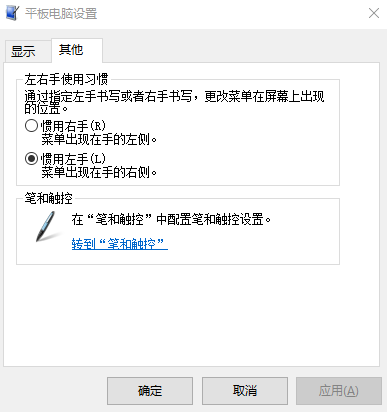
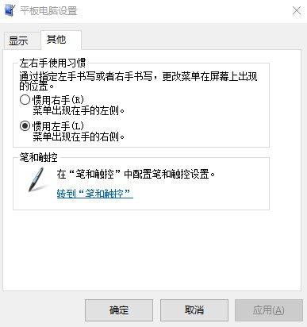
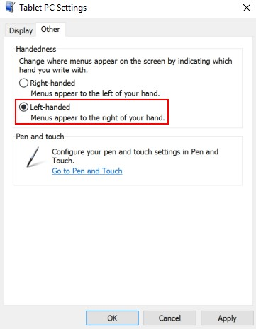
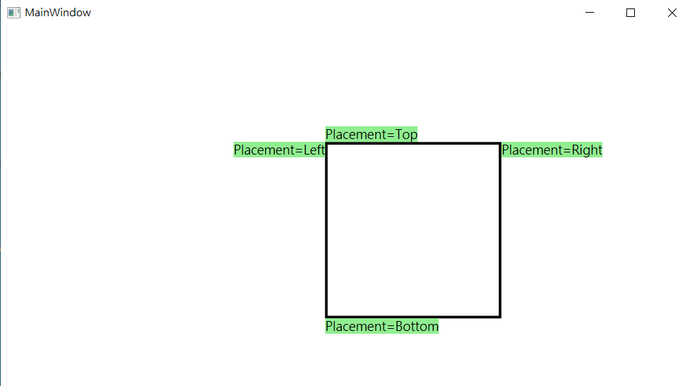
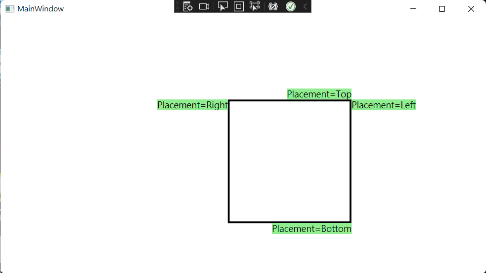

本文告诉大家如何在通过更改注册表的设置，从而更改平板电脑设置 Tablet PC Settings 的左右手使用习惯 Handedness 的惯用左手和惯用右手选项

<!--more-->


<!-- CreateTime:2022/1/19 8:40:14 -->
<!-- 发布 -->

在用户端，可以通过在运行里面，输入 `shell:::{80F3F1D5-FECA-45F3-BC32-752C152E456E}` 按下回车，可以进入平板电脑设置界面，中文版和英文版界面分别如下

<!--  -->


<!--  -->


这个选项将会影响 WPF 的 Popup 弹出的默认方向位置，以及所有的菜单的弹出方向位置

设置惯用左手时的 Popup 弹出行为如下：

<!--  -->


设置惯用右手时的 Popup 弹出行为如下：

<!--  -->


通过注册表修改设置的方式是在运行里输入 `regedit` 打开注册表编辑，进入 `HKEY_CURRENT_USER\SOFTWARE\Microsoft\Windows NT\CurrentVersion\Windows` 路径，修改 `MenuDropAlignment` 选项。默认的 `MenuDropAlignment` 选项是 0 的值，不同的值对应如下

- 0 ： 默认值，惯用左手
- 1 ： 惯用右手

可通过更改 `HKEY_CURRENT_USER\SOFTWARE\Microsoft\Windows NT\CurrentVersion\Windows\MenuDropAlignment` 项从而修改用户设置，修改之后，需要重启才能生效

在 WPF 忽略此属性影响，可以使用如下方法

```csharp
    public static class PopupHacks
    {
        private static FieldInfo? _menuDropAlignmentField;

        /// <summary>
        /// 禁用系统的菜单弹出方向设置，取消对应用程序的Popup弹出方向的影响
        /// </summary>
        public static void DisableSystemMenuPopupAlignment()
        {
            _menuDropAlignmentField = typeof(SystemParameters).GetField("_menuDropAlignment", BindingFlags.NonPublic | BindingFlags.Static);
            System.Diagnostics.Debug.Assert(_menuDropAlignmentField != null);

            EnsureStandardPopupAlignment();
            SystemParameters.StaticPropertyChanged -= SystemParameters_StaticPropertyChanged;
            SystemParameters.StaticPropertyChanged += SystemParameters_StaticPropertyChanged;
        }

        private static void SystemParameters_StaticPropertyChanged(object? sender, PropertyChangedEventArgs e)
        {
            EnsureStandardPopupAlignment();
        }

        private static void EnsureStandardPopupAlignment()
        {
            if (SystemParameters.MenuDropAlignment)
            {
                _menuDropAlignmentField?.SetValue(null, false);
            }
        }
    }
```

更多请看 [Popup element are reversed left and right in Windows 11 · Issue #5944 · dotnet/wpf](https://github.com/dotnet/wpf/issues/5944 )

由于这个功能的入口在 Win11 里完全被干掉了。且即使注册表更改了，整个系统应用、甚至包括记事本等应用，再也不听这个设置了。我认为在 WPF 里面遵守这个规则只会坑到开发者，不如就废弃此功能。我给 WPF 写了一个提案，如果大家认同的话，还请帮我点一个赞支持一下，详细请看 <https://github.com/dotnet/wpf/issues/11073>
