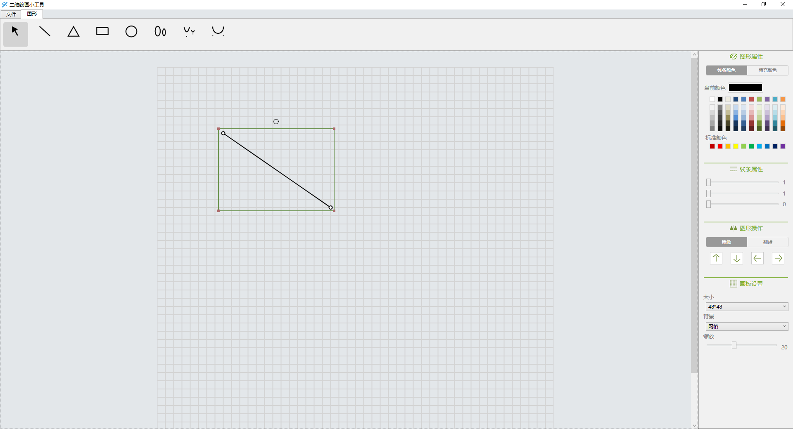

这是一个演示 WPF 进行二维绘画的小工具 Demo 项目，基于 MIT 协议在 GitHub 上完全开源

<!--more-->

<!-- CreateTime:2022/1/29 9:24:05 -->

<!-- 发布 -->

源作者是 [YuWeiCong](https://github.com/YuWeiCong)

我只是帮助开源的工具人

软件运行界面效果：

<!--  -->

开源地址： [https://github.com/dotnet-campus/GeometryToolDemo](https://github.com/dotnet-campus/GeometryToolDemo )

