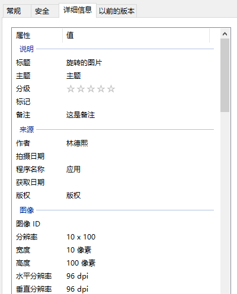
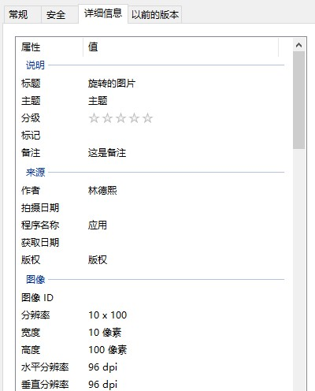

本文将告诉大家如何在 WPF 里面设置图片的 EXIF 信息，包括如何设置图片的旋转信息，以及如何读取 EXIF 的内容

<!--more-->


<!-- CreateTime:2022/9/30 16:36:57 -->

<!-- 发布 -->
<!-- 博客 -->

值得一提的是在 WPF 里面，默认的图片渲染信息是无视 System.Photo.Orientation 信息的，一切都是推荐进行手动控制

在开始之前，咱先来用代码创建一张简单的图片

在 WPF 里面，使用代码进行绘图是一个非常高性能的方法，可以重复使用 DirectX 提供的高性能绘制能力，再加上 WPF 特别友好的 API 进行绘制。而且 WPF 的上层 API 是统一的，屏蔽掉很多细节，不需要更多额外的知识即可使用

先创建一个 DrawingVisual 对象，在这里面传入想要绘制的内容，接着使用 RenderTargetBitmap 存放为图片，最后再使用编码器生成图片

以下是创建 DrawingVisual 进行简单绘制的代码

```csharp
        var drawingVisual = new DrawingVisual();
        using (var drawingContext = drawingVisual.RenderOpen())
        {
            drawingContext.DrawRectangle(Brushes.White, null, new Rect(new Size(100, 10)));
            drawingContext.DrawLine(new Pen(Brushes.Black, 2), new Point(2, 5), new Point(90, 5));
        }
```

这里先绘制一个矩形是为了撑开范围，作为画布大小

以上代码准确来说，是没有进行任何实际的绘制逻辑，只是告诉 WPF 框架，应该如何进行绘制。那啥时候才能进行绘制？需要在实际用到绘制的时候，才会调用 DirectX 进行绘制，例如调用 RenderTargetBitmap 的 Render 方法，将绘制的指令转换为绘制为内存的图片

```csharp
        var dpiScale = VisualTreeHelper.GetDpi(this);
        var renderTargetBitmap = new RenderTargetBitmap(100, 10, dpiScale.PixelsPerInchX, dpiScale.PixelsPerInchY,
            PixelFormats.Pbgra32);
        renderTargetBitmap.Render(drawingVisual);
```

想要将内存里的图片存放到文件里面，就需要先对此按照一定的规则进行编码，例如本文将使用 Jpg 编码

先新建编码器

```csharp
        var jpegBitmapEncoder = new JpegBitmapEncoder();
```

接着传入 RenderTargetBitmap 用来编码

```csharp
        var bitmapFrame = BitmapFrame.Create(renderTargetBitmap);
        jpegBitmapEncoder.Frames.Add(bitmapFrame);
```

最后输出为文件

```csharp
        var file = Path.GetTempFileName() + ".jpg";
        using (var fileStream = new FileStream(file, FileMode.Create, FileAccess.ReadWrite))
        {
            jpegBitmapEncoder.Save(fileStream);
        }
```

在 BitmapFrame 的创建代码里，可以指定 BitmapMetadata 用来设置 EXIF 信息，例如创建了以下的 BitmapMetadata 对象

```csharp
        var bitmapMetadata = new BitmapMetadata("jpg")
        {
            Title = "旋转的图片",
            Author = new ReadOnlyCollection<string>(new[] { "林德熙" }),
            Comment = "这是备注",
            Copyright = "版权",
            Subject = "主题",
            ApplicationName = "应用",
        };
```

那么从保存的图片的属性即可拿到上面传入的内容

<!--  -->



本文所需要的旋转信息，也是设置到 BitmapMetadata 内容，使用 SetQuery 方法进行设置

```csharp
        const int Rotate90 = 6;
        bitmapMetadata.SetQuery("System.Photo.Orientation", Rotate90);
```

除了这个旋转信息，能写入属性有哪些，写入的类型是什么？这些可以从 [官方文档](https://docs.microsoft.com/en-us/windows/win32/properties/windows-properties-system?WT.mc_id=WD-MVP-5003260) 获取

以下就是全部的创建图片的代码

```csharp
        var drawingVisual = new DrawingVisual();
        using (var drawingContext = drawingVisual.RenderOpen())
        {
            drawingContext.DrawRectangle(Brushes.White, null, new Rect(new Size(100, 10)));
            drawingContext.DrawLine(new Pen(Brushes.Black, 2), new Point(2, 5), new Point(90, 5));
        }

        var dpiScale = VisualTreeHelper.GetDpi(this);
        var renderTargetBitmap = new RenderTargetBitmap(100, 10, dpiScale.PixelsPerInchX, dpiScale.PixelsPerInchY,
            PixelFormats.Pbgra32);
        renderTargetBitmap.Render(drawingVisual);

        var jpegBitmapEncoder = new JpegBitmapEncoder();
        var bitmapMetadata = new BitmapMetadata("jpg")
        {
            Title = "旋转的图片",
            Author = new ReadOnlyCollection<string>(new[] { "林德熙" }),
            Comment = "这是备注",
            Copyright = "版权",
            Subject = "主题",
            ApplicationName = "应用",
        };
        const int Rotate90 = 6;
        bitmapMetadata.SetQuery("System.Photo.Orientation", Rotate90);

        var bitmapFrame = BitmapFrame.Create(renderTargetBitmap, thumbnail: null, bitmapMetadata,
            new ReadOnlyCollection<ColorContext>(new List<ColorContext>()));
        jpegBitmapEncoder.Frames.Add(bitmapFrame);

        var file = Path.GetTempFileName() + ".jpg";
        using (var fileStream = new FileStream(file, FileMode.Create, FileAccess.ReadWrite))
        {
            jpegBitmapEncoder.Save(fileStream);
        }
```

接下来在 XAML 放一个 Image 控件，设置图片文件给图片控件，可以看到图片控件是无视 System.Photo.Orientation 的内容

```csharp
        Image.Source = new BitmapImage(new Uri(file));
```

接下来尝试读取解析图片的 EXIF 信息，获取到旋转角度

先进行解码，从本地文件获取到图片文件，需要将图片文件解码，才能在内存里面认识这个图片

```csharp
        var decoder = BitmapDecoder.Create
        (
            new Uri(file, UriKind.Absolute),
            BitmapCreateOptions.DelayCreation,
            BitmapCacheOption.None
        );
```

为了性能考虑，这里只是读取 EXIF 信息，就设置了 DelayCreation 标记，如此就不会全部解析图片的内容

获取 BitmapFrame 内容

```csharp
        var frame = decoder.Frames[0];
```

接着读取 BitmapMetadata 信息

```csharp
        const string query = "System.Photo.Orientation";
        return frame.Metadata is BitmapMetadata bitmapMetadata
               && bitmapMetadata.ContainsQuery(query)
               && bitmapMetadata.GetQuery(query) is ushort orientation
            ? orientation switch
            {
                6 => Rotation.Rotate90,
                3 => Rotation.Rotate180,
                8 => Rotation.Rotate270,
                _ => Rotation.Rotate0,
            }
            : Rotation.Rotate0;
```

根据旋转角度，可以获取到显示的尺寸

```csharp
   var size = rotation is Rotation.Rotate90 or Rotation.Rotate270
            ? new Size(frame.PixelHeight, frame.PixelWidth)
            : new Size(frame.PixelWidth, frame.PixelHeight);
```

全部的读取代码如下

```csharp
    private void Decode(string file)
    {
        var decoder = BitmapDecoder.Create
        (
            new Uri(file, UriKind.Absolute),
            BitmapCreateOptions.DelayCreation,
            BitmapCacheOption.None
        );

        var frame = decoder.Frames[0];

        var rotation = GetRotation(frame);

        var size = rotation is Rotation.Rotate90 or Rotation.Rotate270
            ? new Size(frame.PixelHeight, frame.PixelWidth)
            : new Size(frame.PixelWidth, frame.PixelHeight);
    }

    private Rotation GetRotation(BitmapFrame frame)
    {
        const string query = "System.Photo.Orientation";
        return frame.Metadata is BitmapMetadata bitmapMetadata
               && bitmapMetadata.ContainsQuery(query)
               && bitmapMetadata.GetQuery(query) is ushort orientation
            ? orientation switch
            {
                6 => Rotation.Rotate90,
                3 => Rotation.Rotate180,
                8 => Rotation.Rotate270,
                _ => Rotation.Rotate0,
            }
            : Rotation.Rotate0;
    }
```

本文代码放在[github](https://github.com/lindexi/lindexi_gd/tree/aee84bc738984fe0df51bea703ace2e721f9ec99/HineakemnerFeceqerhai) 和 [gitee](https://gitee.com/lindexi/lindexi_gd/tree/aee84bc738984fe0df51bea703ace2e721f9ec99/HineakemnerFeceqerhai) 欢迎访问

可以通过如下方式获取本文的源代码，先创建一个空文件夹，接着使用命令行 cd 命令进入此空文件夹，在命令行里面输入以下代码，即可获取到本文的代码

```
git init
git remote add origin https://gitee.com/lindexi/lindexi_gd.git
git pull origin aee84bc738984fe0df51bea703ace2e721f9ec99
```

以上使用的是 gitee 的源，如果 gitee 不能访问，请替换为 github 的源。请在命令行继续输入以下代码

```
git remote remove origin
git remote add origin https://github.com/lindexi/lindexi_gd.git
git pull origin aee84bc738984fe0df51bea703ace2e721f9ec99
```

获取代码之后，进入 HurcadahejaiYawhekurji 文件夹

在 UWP 里，写入 EXIF 信息，请参阅 [UWP 写入图片 Exif 信息](https://blog.lindexi.com/post/UWP-%E5%86%99%E5%85%A5%E5%9B%BE%E7%89%87-Exif-%E4%BF%A1%E6%81%AF.html )
