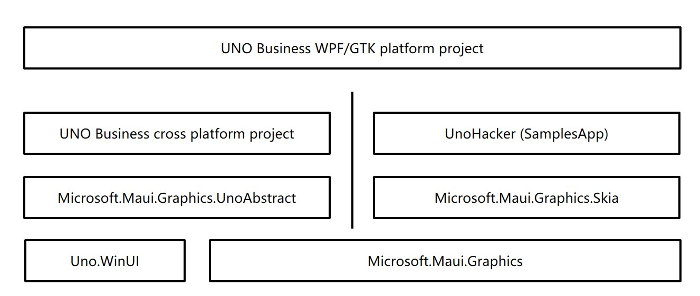
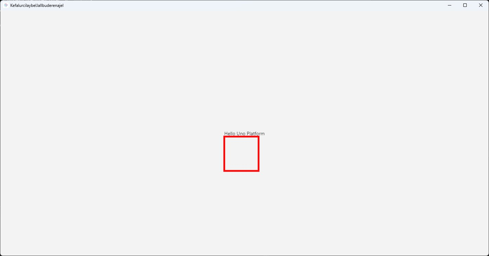

This article will guide you on how to integrate Microsoft.Maui.Graphics into the UNO framework. Once the integration of Microsoft.Maui.Graphics is complete, it allows the UNO framework to reuse many existing drawing infrastructures and libraries, and further connect with MAUI.

<!--more-->


<!-- CreateTime:2024/1/29 11:46:07 -->

<!-- 发布 -->


As we know, a large number of project types in UNO are built based on Skia as the underlying rendering engine. In Microsoft.Maui.Graphics, there is an implementation for Skia, namely the Microsoft.Maui.Graphics.Skia implementation method. According to the [UNO Skia example](https://github.com/unoplatform/Uno.Samples/tree/master/UI/SkiaSharpTest), we can use SKXamlCanvas to directly draw Skia content in UNO.

However, the bad news is that as of January 29, 2024, the SKXamlCanvas in UNO is connected to UNO in a hacky way. In SKXamlCanvas, a new SKSurface will be recreated for developers to draw on, and then the drawn Bitmap will be copied to UNO's WriteableBitmap via the CPU, allowing UNO to use the form of picture drawing to draw the WriteableBitmap. The indirect connection method between WriteableBitmap and Skia will greatly affect the drawing performance, and there is a lot of CPU pressure and drawing delay in the middle of the drawing. The discussion address of this issue is: <https://github.com/unoplatform/uno/discussions/15097>.

To reduce the impact of the hacky way of SKXamlCanvas, this article uses the Visual drawing method that is not public in the UNO framework. Since this method uses the API function implemented by the UNO framework privately, the method provided in this article may be invalid in subsequent UNO update versions.

This article does not provide a ready-to-use method, instead, it provides a set of source code building docking methods. After reading this article, you will learn how to build your own UNO project with Microsoft.Maui.Graphics docking code, and understand the detailed implementation logic, which is convenient for you to further customize. At the end of this article, you will find the download method of all the codes used in this article.

The following of this article provides a way to directly dock with UNO's Visual on the Uno.Skia.WPF and Uno.Skia.GTK platforms, instead of the SKXamlCanvas method that has gone through WriteableBitmap, to dock with Microsoft.Maui.Graphics.Skia, and then dock Microsoft.Maui.Graphics to the UNO framework.

The overall architecture reference relationship diagram is as follows:

<!--  -->


The Microsoft.Maui.Graphics.UnoAbstract and UnoHacker (SamplesApp) in the above figure are the parts that we will focus on next. An additional part of the work is placed on the docking code of the Uno.Skia.WPF and Uno.Skia.GTK platforms. The docking workload of the platform project is very small and the required code volume is very small.

Start with the construction of the Microsoft.Maui.Graphics.UnoAbstract project. In the Microsoft.Maui.Graphics.UnoAbstract project, some Hack interfaces are provided for UnoHacker (SamplesApp) to use, which is convenient for the upper application framework to dock. Its defined code is as follows:

```csharp
using Microsoft.UI.Xaml;

namespace Microsoft.Maui.Graphics.UnoAbstract;

public interface IHack
{
    FrameworkElement Create();
}

public static class HackHelper
{
    public static IHack? Hack { set; get; }
}
```

Through the above code, you can inject the value of the Hack object into HackHelper. In addition, in order to get the drawing notification, that is, the more special implementation with FrameworkElement, you also need to add an interface named IDrawableNotify in the Microsoft.Maui.Graphics.UnoAbstract project, the code is as follows:

```csharp
namespace Microsoft.Maui.Graphics.UnoAbstract;

public interface IDrawableNotify
{
    event EventHandler<ICanvas>? Draw;
}
```

After completing the basic interface definition, you can write the GraphicsCanvas type for the general cross-platform UNO business project directly in the Microsoft.Maui.Graphics.UnoAbstract project. This GraphicsCanvas type will inherit the Microsoft.UI.Xaml.Controls.Canvas type, which can be directly added in XAML, and trigger the Draw event when starting to draw, which is convenient for business code to use the Draw event to write Microsoft.Maui.Graphics drawing business code.

```csharp
using Microsoft.UI.Xaml;
using Microsoft.UI.Xaml.Controls;

namespace Microsoft.Maui.Graphics.UnoAbstract;

public class GraphicsCanvas : Canvas, IDrawableNotify
{
    public GraphicsCanvas()
    {
        SizeChanged += OnSizeChanged;
        var frameworkElement = HackHelper.Hack?.Create();

        if (frameworkElement != null)
        {
            IDrawableNotify drawableNotify = (IDrawableNotify) frameworkElement;
            drawableNotify.Draw += OnDraw;
            Children.Add(frameworkElement);
            FrameworkElement = frameworkElement;
        }
        else
        {
            var textBlock = new TextBlock()
            {
                Text = "Not Supported"
            };

            FrameworkElement = textBlock;
        }
    }

    private FrameworkElement FrameworkElement { get; }

    private void OnDraw(object? sender, ICanvas e)
    {
        Draw?.Invoke(this, e);
    }

    private void OnSizeChanged(object sender, SizeChangedEventArgs e)
    {
        FrameworkElement.Width = e.NewSize.Width;
        FrameworkElement.Height = e.NewSize.Height;
    }

    public event EventHandler<ICanvas>? Draw;
}
```

Next, create the UnoHacker (SamplesApp) project. This project needs to set the project's assembly name to `SamplesApp` in order to use some internal members in the UNO framework. For convenience, this project can be directly named as the SamplesApp project. The reason for this name is because Internal is added to the `SamplesApp` assembly in UNO.

Again, because the UnoHacker (SamplesApp) project will use some non-public types of UNO, it may fail in subsequent versions of UNO.

In the UnoHacker (SamplesApp) project, only a simple type is needed. This type will be docked with UNO's Visual. The code is as follows:

```csharp
public class GraphicsCanvasElement : FrameworkElement
{
    public GraphicsCanvasElement()
    {
        Visual.Children.InsertAtBottom(new GraphicsCanvasVisual(Visual.Compositor, this));
    }

    public event EventHandler<ICanvas>? Draw;

    internal void InvokeDraw(ICanvas canvas)
    {
        Draw?.Invoke(this, canvas);
    }

    class GraphicsCanvasVisual : Visual
    {
        public GraphicsCanvasVisual(Compositor compositor, GraphicsCanvasElement owner) : base(compositor)
        {
            _owner = new WeakReference<GraphicsCanvasElement>(owner);
        }

        private readonly WeakReference<GraphicsCanvasElement> _owner;

        internal override void Draw(in DrawingSession session)
        {
            if (_owner.TryGetTarget(out var graphicsCanvasElement))
            {
                using var skiaCanvas = new SkiaCanvas();
                skiaCanvas.Canvas = session.Surface.Canvas;
                graphicsCanvasElement.InvokeDraw(skiaCanvas);
            }
        }
    }
}
```

So far, the basic code for docking with Microsoft.Maui.Graphics has been completed. The remaining work needs to write docking code in the specific Uno.Skia platform project. By writing docking code in the Uno.Skia platform project, Microsoft.Maui.Graphics.UnoAbstract and UnoHacker (SamplesApp) projects can be docked. An additional explanation is why Microsoft.Maui.Graphics.UnoAbstract and UnoHacker (SamplesApp) projects cannot be merged. The reason is to allow the Microsoft.Maui.Graphics.UnoAbstract project to be used on the non-Skia implementation platform of UNO, and only let the UnoHacker (SamplesApp) project strongly reference the Skia implementation of UNO, so that the Microsoft.Maui.Graphics.UnoAbstract project can be simultaneously UNO's WinUI3 and other non-Skia implementation projects are docked.

Next, start writing Uno.Skia.WPF and Uno.Skia.GTK platform docking code. The platform docking code content of these two parts is the same. First define a control named `HackElement` that inherits GraphicsCanvasElement. The code is as follows. This type of control is defined just for the convenience of unified docking code:

```csharp
public partial class HackElement : GraphicsCanvasElement, IDrawableNotify
{
}
```

Then create a type named `Hack`, let this type inherit the IHack interface of Microsoft.Maui.Graphics.UnoAbstract, the code is as follows:

```csharp
public class Hack : IHack
{
    public FrameworkElement Create()
    {
        return new HackElement();
    }
}
```

Finally, create the HackInitializer type, which is used to put the Hack type into the HackHelper static type of Microsoft.Maui.Graphics.UnoAbstract:

```csharp
static class HackInitializer
{
    public static void Init()
    {
        HackHelper.Hack = new Hack();
    }
}
```

Through the above encapsulation code, you can call the Init method of HackInitializer in each platform project to complete all docking logic. For example, in the default App constructor of Uno.Skia.Wpf, call the `HackInitializer.Init();` code. For example, in the Program of the Uno.Skia.GTK project, use the following code to call the docking method:

```csharp
public class Program
{
    public static void Main(string[] args)
    {
        ExceptionManager.UnhandledException += delegate (UnhandledExceptionArgs expArgs)
        {
            Console.WriteLine("GLIB UNHANDLED EXCEPTION" + expArgs.ExceptionObject.ToString());
            expArgs.ExitApplication = true;
        };

        HackInitializer.Init();

        var host = new GtkHost(() => new AppHead());

        host.Run();
    }
}
```

After completing all docking logic, you can use GraphicsCanvas to draw business code interface in UNO's full platform project. For example, add the following code in MainPage.xaml:

```xml
      xmlns:graphics="using:Microsoft.Maui.Graphics.UnoAbstract"

  <StackPanel x:Name="StackPanel"
        HorizontalAlignment="Center"
        VerticalAlignment="Center">
    <TextBlock x:Name="TextBlock" AutomationProperties.AutomationId="HelloTextBlock"
          Text="Hello Uno Platform"
          HorizontalAlignment="Center" />
    <Border Background="AliceBlue">
      <graphics:GraphicsCanvas Draw="GraphicsCanvas_OnDraw"/>
    </Border>
  </StackPanel>
```

In the background code, you can get the start of the docking with Microsoft.Maui.Graphics in the Microsoft.Maui.Graphics.ICanvas parameter of the `GraphicsCanvas_OnDraw` method, as follows:

```csharp
    private void GraphicsCanvas_OnDraw(object? sender, ICanvas e)
    {
        e.StrokeSize = 5;
        e.StrokeColor = Colors.Red;
        e.DrawRectangle(0, 0, 100, 100);
    }
```

Run the project, you can see the following interface:

<!--  -->


The source code mentioned in this article is available on [GitHub](https://github.com/lindexi/lindexi_gd/tree/daf3e44a853177d55e9ebb15d989e27b1e497591/KefalurcilaybelJallbuderenajel) and [Gitee](https://gitee.com/lindexi/lindexi_gd/tree/daf3e44a853177d55e9ebb15d989e27b1e497591/KefalurcilaybelJallbuderenajel). You are welcome to visit.

You can obtain the source code of this article by following these steps:

1. First, create an empty folder.
2. Then, use the command line `cd` command to enter this empty folder.
3. In the command line, enter the following code to get the code of this article:

```
git init
git remote add origin https://gitee.com/lindexi/lindexi_gd.git
git pull origin daf3e44a853177d55e9ebb15d989e27b1e497591
```

The above uses the Gitee source. If Gitee cannot be accessed, please replace it with the GitHub source. Please continue to enter the following code in the command line:

```
git remote remove origin
git remote add origin https://github.com/lindexi/lindexi_gd.git
git pull origin daf3e44a853177d55e9ebb15d989e27b1e497591
```

After obtaining the code, enter the `KefalurcilaybelJallbuderenajel` folder.
