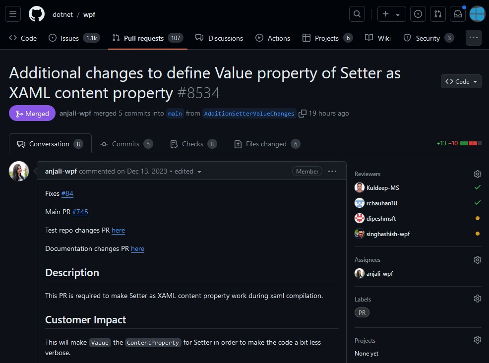

本文记录 WPF 在 dotnet 9 的一项 XAML 编写语法改进点，此改进点用于解决编写 Style 的 Setter 进行给 Value 赋值时，不能将 Value 当成默认内容，需要多写 Value 标签的问题。通过此改进点可减少两行 XAML 代码

<!--more-->


<!-- CreateTime:2024/05/09 07:29:07 -->

<!-- 发布 -->
<!-- 博客 -->

更新： 由于此功能导致 BAML 内容变化，由高版本 SDK 构建将在低版本 Runtime 运行不起来。直接报错信息是 System.Windows.Markup.XamlParseException 异常，内部是 IndexOutOfRangeException: Index was outside the bounds of the array 异常。于是最终决定撤回更改

---

在原先的 WPF 版本里面，对 Style 的 Setter 填充复杂的对象内容时，大概的示例代码如下

```xml
<Style TargetType="Button">
    <Setter Property="Template">
        <Setter.Value>
            <ControlTemplate TargetType="Button">
                ...
            </ControlTemplate>
        </Setter.Value>
    </Setter>
</Style>
```

可以看到 `<Setter.Value>` 属于不可省略的内容

在本次引入的改进之后，即可将 Setter 的 Value 当成默认内容，从而减少 `<Setter.Value>` 的代码，改进后的写法如下

```xml
<Style TargetType="Button">
    <Setter Property="Template">
        <ControlTemplate TargetType="Button">
            ...
        </ControlTemplate>
    </Setter>
</Style>
```

此改进是在许多年前，由 [Thomas Levesque](https://github.com/thomaslevesque) 大佬在 <https://github.com/dotnet/wpf/issues/84> 提出的。被微软的 [Anjali](https://github.com/anjali-wpf) 在 <https://github.com/dotnet/wpf/pull/8534> 实现

<!--  -->


此变更将影响 XAML 语法，对应的文档也进行了同步更新，详细请看 <https://github.com/dotnet/dotnet-api-docs/pull/9581>

为什么之前的版本里面，必须编写 `<Setter.Value>` 呢？这是因为在原先的版本里面 Style 的 Setter 的 Value 不是默认的内容，即在 Setter 标签里面直接放入内容，将不能被放入到 Value 属性里面

在 <https://github.com/dotnet/wpf/pull/8534> 的实现里面，将 Setter 的 Value 当成默认内容，于是在 Setter 里面放入的内容，将会自动给 Value 进行赋值

上述的核心逻辑在 src/Microsoft.DotNet.Wpf/src/PresentationFramework/System/Windows/Markup/Baml2006/WpfGeneratedKnownTypes.cs 里面，给创建 Setter 时，配置 baml 类型里面内容对应的属性名是 "Value" 属性名，如以下代码

```csharp
        private WpfKnownType Create_BamlType_Setter(bool isBamlType, bool useV3Rules)
        {
            var bamlType = new WpfKnownType(this, // SchemaContext
                                              556, "Setter",
                                              typeof(System.Windows.Setter),
                                              isBamlType, useV3Rules);
            bamlType.DefaultConstructor = delegate() { return new System.Windows.Setter(); };
            bamlType.ContentPropertyName = "Value"; // 这是本次更改的核心逻辑
            bamlType.Freeze();
            return bamlType;
        }
```

当前的 WPF 在 [https://github.com/dotnet/wpf](https://github.com/dotnet/wpf) 完全开源，使用友好的 MIT 协议，意味着允许任何人任何组织和企业任意处置，包括使用，复制，修改，合并，发表，分发，再授权，或者销售。在仓库里面包含了完全的构建逻辑，只需要本地的网络足够好（因为需要下载一堆构建工具），即可进行本地构建
