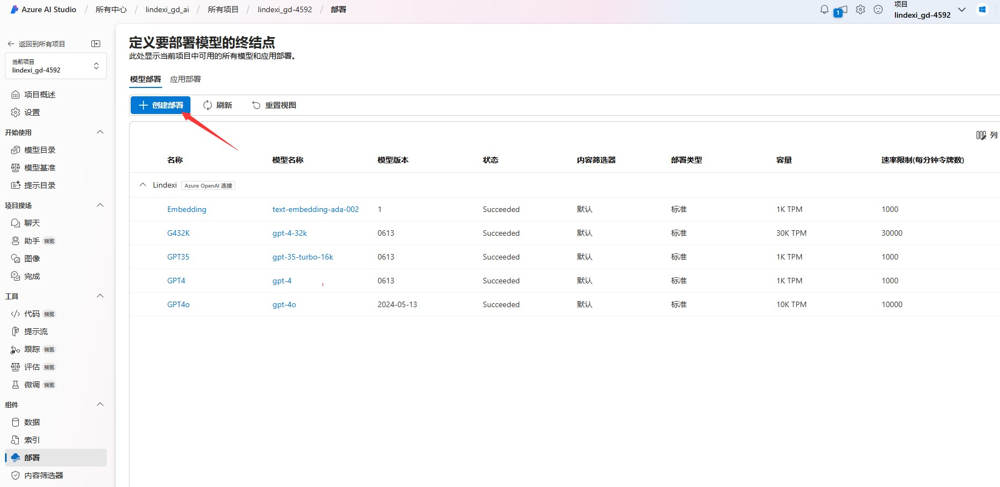
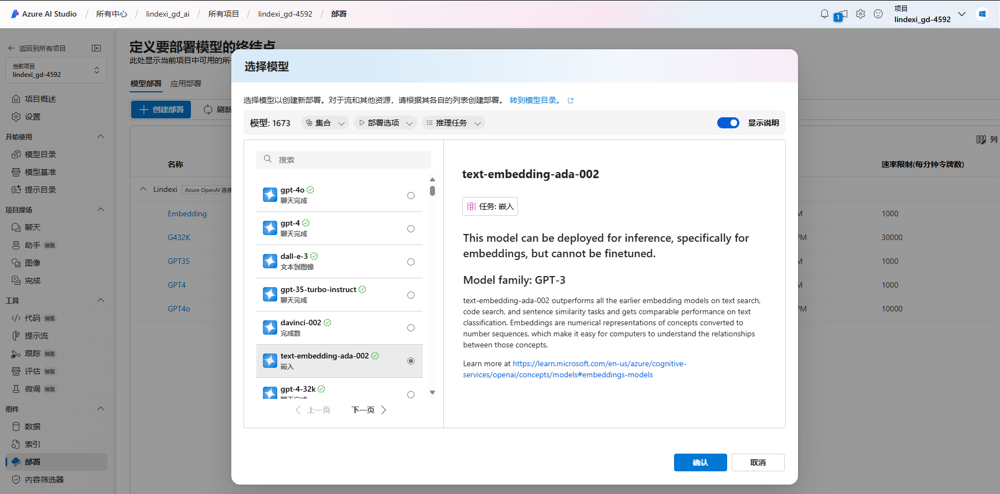
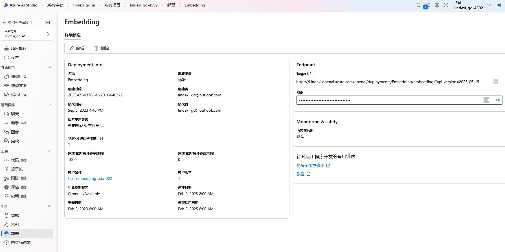

本文将和大家简单介绍一下如何在控制台里面使用 Microsoft.KernelMemory 调用 TextEmbedding 对一些文本知识库内容生成向量化信息，以及进行向量化查询

<!--more-->


<!-- CreateTime:2024/06/16 07:23:16 -->

<!-- 发布 -->
<!-- 博客 -->

本文属于 SemanticKernel 入门系列博客，更多博客内容请参阅我的 [博客导航](https://blog.lindexi.com/post/%E5%8D%9A%E5%AE%A2%E5%AF%BC%E8%88%AA.html ) 或 [博客园的合集](https://www.cnblogs.com/lindexi/collections/6439)

根据 new bing 对 Microsoft.KernelMemory 的如下介绍，可以知道 KernelMemory 的基础功能

<!-- 

简单介绍 Microsoft.KernelMemory 调用 TextEmbedding 的功能

-->

Microsoft.KernelMemory 是一个开源的服务和插件，专门用于通过自定义的连续数据混合管道对数据集进行高效的索引。它的目标是模拟人类大脑如何存储和检索关于世界的知识。其中，嵌入（Embeddings） 是一项关键功能，用于创建语义映射，将概念或实体表示为高维空间中的向量。

嵌入是一种强大的工具，用于帮助软件开发人员处理人工智能和自然语言处理。它们通过将单词表示为高维向量而不是简单的字符字符串，以更复杂的方式帮助计算机理解单词的含义。嵌入通常以数值向量的形式存在，例如由数百个浮点数组成的列表。这些向量通过将每个已知的标记（token）映射到高维空间中的一个点来工作。设计这个空间和标记词汇表的目的是使具有相似含义的单词位于彼此附近。这使得算法能够在不需要显式规则或人工监督的情况下识别单词之间的关系，例如同义词或反义词。

在开始之前，期望大家已经有了 Azure 的 AI 账号权限，如果现在还没有权限，请填写 <https://aka.ms/oai/access> 进行申请。网上有很多申请攻略，如果大家不知道如何填写的话，还请自行参考网上大佬们写的攻略

先进入到 <https://ai.azure.com/> 进行部署项目，如果大家现在没有权限但只是想测试一下，可以找我要借账号给你自己测试一下

由于 AzureAI 的界面更新比较快，本文以下截图都是在 2024.06 截图的，如果你阅读本文的时间距离本文编写时间过长，那可能界面很多都会不一样，但相信大家看界面还是会创建模型的

先点击`创建部署`按钮，如下图

<!--  -->


接着在选择模型这里选择 TextEmbedding 模型，本文这里选择的是 text-embedding-ada-002 模型，这是当前总体表现都很好的模型

<!--  -->


创建模型时需要给模型命名，这个命名将在后续咱的代码里面调用。我这里的部署名称使用的是 `Embedding` 名称，完成部署之后的界面内容大概如下

<!--  -->



完成以上准备工作之后，接下来可以开始新建控制台编写代码了。先新建一个 .NET 8 框架的控制台，当然了，这个时间点你要是激进一些也可以创建 .NET 9 框架的

先按照 .NET 的惯例安装 [Microsoft.KernelMemory.Core](https://nuget.org/packages/Microsoft.KernelMemory.Core) 这个库，安装之后的 csproj 项目文件的代码大概如下

```xml
<Project Sdk="Microsoft.NET.Sdk">

  <PropertyGroup>
    <OutputType>Exe</OutputType>
    <TargetFramework>net8.0</TargetFramework>
    <ImplicitUsings>enable</ImplicitUsings>
    <Nullable>enable</Nullable>
  </PropertyGroup>

  <ItemGroup>
    <PackageReference Include="Microsoft.KernelMemory.Core" Version="0.62.240605.1" />
  </ItemGroup>

</Project>
```

先引用命名空间

```csharp
using Microsoft.KernelMemory;
```

接着初始化进行一些配置，配置代码如下

```csharp
var endpoint = "https://lindexi.openai.azure.com/"; // 请换成你的地址
var apiKey = File.ReadAllText(@"C:\lindexi\CA\Key"); // 请换成你的密钥

var kernel = new KernelMemoryBuilder()
    .WithSimpleFileStorage("Folder")
    .WithoutTextGenerator()
    .WithAzureOpenAITextEmbeddingGeneration(new AzureOpenAIConfig()
    {
        Endpoint = endpoint,
        APIKey = apiKey,
        Deployment = "Embedding",
        APIType = AzureOpenAIConfig.APITypes.EmbeddingGeneration,
        Auth = AzureOpenAIConfig.AuthTypes.APIKey
    })
    .Build();
```

以上代码里面的 endpoint 和 apiKey 和 Deployment 分别换成你的地址和你的密钥以及你的部署名称

本文只是演示如何调用文本嵌入向量化，不涉及到文本生成，于是加上了 `WithoutTextGenerator` 配置，加上了此配置之后，后续的 Ask 系列方法将不能调用。本文这里为了方便起见，将知识库向量化之后存放到本地文件夹里面，即通过 `.WithSimpleFileStorage("Folder")` 配置存放到相对工作路径的 Folder 文件夹。大家可以尝试运行项目之后看看你的这个文件夹里面的内容

拿到了 IKernelMemory 类型的 kernel 对象之后，接下来就可以导入知识库的知识了。如以下我导入了一些我的博客内容作为知识

```csharp
await kernel.ImportTextAsync("本文记录在 WPF 项目里面设置 IncludePackageReferencesDuringMarkupCompilation 属性为 False 导致了项目所安装的分析器不能符合预期工作 设置 IncludePackageReferencesDuringMarkupCompilation 属性为 false 将配置 WPF 在构建 XAML 过程中创建的 tmp.csproj 过程中将不引用依赖的 nuget 包。分析器默认也是通过 nuget 包方式安装的，这就导致了分析器项目没有被 tmp.csproj 项目正确使用到 如果项目里面有代码依赖分析器生成的影响语义的代码，那这部分代码将会构建不通过");

await kernel.ImportTextAsync("在 dotnet 6 时，官方为了适配好 Source Generators 功能，于是默认就将 WPF 的 XAML 构建过程中，引入第三方库的 cs 文件，这个功能默认设置为开启。刚好源代码包为了修复在使用 dotnet 6 SDK 之前，在 WPF 的构建 XAML 过程中，不包含第三方库的代码文件，从而使用黑科技将源代码包加入到 WPF 构建 XAML 中。在 VisualStudio 升级到 2022 版本，或者是升级 dotnet sdk 到 dotnet 6 版本，将会更新构建调度，让源代码包里的代码文件被加入两次，从而构建失败\r\n构建失败的提示如下\r\n\r\n```\r\nC:\\Program Files\\dotnet\\sdk\\6.0.101\\Sdks\\Microsoft.NET.Sdk\\targets\\Microsoft.NET.Sdk.DefaultItems.Shared.targets(190,5): error NETSDK1022: 包含了重复的“Compile”项。.NET SDK 默认包含你项目目录中的“Compile”项。可从项目文件中删除这些项；如果希望将其显式包含在项目文件中，可将“EnableDefaultCompileItems”属性设置为“false”。有关详细信息，请参阅 https://aka.ms/sdkimplicititems。重复项为: \r\n```重复的原因是 WPF 在 .NET SDK 里修复了在 XAML 构建过程中，没有引用 NuGet 包里面的文件。而源代码包许多都是在此修复之前打出来的，源代码包为了修复在 XAML 里面没有引用文件，就强行加上修复逻辑引用文件。而在 dotnet 6 修复了之后，自然就会导致引用了多次 修复方法很简单，在不更改源代码包的前提下，可以在 csproj 项目文件里加入以下代码```xml\r\n    <IncludePackageReferencesDuringMarkupCompilation>False</IncludePackageReferencesDuringMarkupCompilation>\r\n```");

await kernel.ImportTextAsync("默认情况下的 WPF 项目都是带 -windows 的 TargetFramework 方式，但有一些项目是不期望加上 -windows 做平台限制的，本文将介绍如何实现不添加 -windows 而引用 WPF 框架 对于一些特殊的项目来说，也许只是在某些模块下期望引用 WPF 的某些类型，而不想自己的项目限定平台。这时候可以去掉 `-windows` 换成 FrameworkReference 的方式 通过 `<FrameworkReference Include=\"Microsoft.WindowsDesktop.App.WPF\" />` 即可设置对 WPF 程序集的引用，也就是仅仅只是将 WPF 的程序集取出来当成引用，而不是加上 WPF 的负载");

await kernel.ImportTextAsync("dotnet 如何访问到 UNO 框架里面的 internal 不公开成员? 核心原理是基于 UNO 框架里面的 InternalsVisibleToAttribute 程序集特性，指定给到 SamplesApp 等程序集可见。因此只需要新建一个程序集，设置 AssemblyName 为 SamplesApp 即可");
```

以上的导入逻辑将会调用上文部署的 text-embedding-ada-002 模型，将文本内容进行向量化，将向量化之后的结果存放到本地的文件里面，使用本地文件系统作为知识数据库。后续的查询逻辑即可读取本地文件的向量进行向量距离对比，支持语义化查询

传统的查询大部分都是关键词进行字符串比较，而通过 text-embedding-ada-002 等 TextEmbedding 模型，即可进行语义化查询。核心原理是计算出查询字符串的向量值，与知识数据库里面存放的知识的向量进行比较，从而获取到向量距离较近的知识，向量距离越近表示约有相关性。通过此方法可以更好的进行查询知识，特别是处理海量知识库信息查询的时候

建立知识库步骤只需要做一次调用 TextEmbedding 模型，不需要每次查询数据都重新对整个知识库进行调用 TextEmbedding 模型。因为调用一次之后，就获取到 TextEmbedding 模型返回的向量化信息。之后只需要对查询的信息的内容调用 TextEmbedding 模型获取查询信息的向量化信息，再将查询信息的向量化信息与知识库里面的各个知识的向量化信息进行比较即可，即可找到查询信息与各个知识的相关性

如以下代码尝试进行一条查询

```csharp
var searchResult = await kernel.SearchAsync("如何访问 UNO 不公开成员");
```

以上查询可以拿到查询结果，一般来说查询结果需要关注其相关性，即 Relevance 属性的值。大部分情况下的业务只取第一条，即最相关的内容

```csharp
var searchResult = await kernel.SearchAsync("如何访问 UNO 不公开成员");

if (searchResult.NoResult)
{
    Console.WriteLine("没有找到相关项");
    return;
}

foreach (var citation in searchResult.Results)
{
    // 大部分情况下，只取第一项
    foreach (var partition in citation.Partitions)
    {
        Console.WriteLine($"关联性： {partition.Relevance:0.00} 内容： {partition.Text}");
    }
}
```

运行以上代码的输出如下

```
关联性： 0.84 内容： dotnet 如何访问到 UNO 框架里面的 internal 不公开成员? 核心原理是基于 UNO 框架里面的 InternalsVisibleToAttribute 程序集特性，指定给到 SamplesApp 等程序集可见。因此只需要新建一个程序集，设置 AssemblyName 为 SamplesApp 即 可
关联性： 0.66 内容： NET SDK 里修复了在 XAML 构建过程中，没有引用 NuGet 包里面的文件。而源代码包许多都是在此修复之前打出来的，源代码包为了修复在 XAML 里面没有引用文件，就强行加上修复逻辑引用文件。而在 dotnet 6 修复了之后，自然就会导致引用了多次 修复方法很简单，在不更改源代码包的前提下，可以在 csproj 项目文件里加入以下代码```xml
<IncludePackageReferencesDuringMarkupCompilation>False</IncludePackageReferencesDuringMarkupCompilation>`` `
关联性： 0.64 内容： 在 dotnet 6 时，官方为了适配好 Source Generators 功能，于是默认就将 WPF 的 XAML 构建过程中，引入第 三方库的 cs 文件，这个功能默认设置为开启。刚好源代码包为了修复在使用 dotnet 6 SDK 之前，在 WPF 的构建 XAML
过程中，不包含第三方库的代码文件，从而使用黑科技将源代码包加入到 WPF 构建 XAML 中。在 VisualStudio 升级到 2022 版本，或 者是升级 dotnet sdk 到 dotnet 6 版本，将会更新构建调度，让源代码包里的代码文件被加入两次，从而构建失败
构建失败的提示如下` ``
C:\Program Files\dotnet\sdk\6.0.101\Sdks\Microsoft.NET.Sdk\targets\Microsoft.NET.Sdk.DefaultItems.Shared.targets(190,5): error NETSDK1022: 包含了重复的“Compile”项。.NET SDK 默认包含你项目目录中的“Compile”项。可从项目文件中删除这些项；如果希望将其显式包含在项目文件中，可将“EnableDefaultCompileItems”属性设置为“false”。有关详细信息，请参阅 https://aka.ms/sdkimplicititems。重复项为:
` ``重复的原因是 WPF 在 . NET SDK 里修复了在 XAML 构建过程中，没有引用 NuGet
关联性： 0.65 内容： 本文记录在 WPF 项目里面设置 IncludePackageReferencesDuringMarkupCompilation 属性为 False 导致了项目所安装的分析器不能符合预期工作 设置 IncludePackageReferencesDuringMarkupCompilation 属性为 false 将配置 WPF 在构建 XAML 过程中创建的 tmp.
csproj 过程中将不引用依赖的 nuget 包。分析器默认也是通过 nuget 包方式安装的，这就导致了分析器项目没有被 tmp.csproj 项目 正确使用到 如果项目里面有代码依赖分析器生成的影响语义的代码，那这部分代码将会构建不通过
关联性： 0.64 内容： 默认情况下的 WPF 项目都是带 -windows 的 TargetFramework 方式，但有一些项目是不期望加上 -windows 做 平台限制的，本文将介绍如何实现不添加 -windows 而引用 WPF 框架 对于一些特殊的项目来说，也许只是在某些模块下期望引用 WPF  的某些类型，而不想自己的项目限定平台。这时候可以去掉 `-windows` 换成 FrameworkReference 的方式 通过 `<FrameworkReference Include="Microsoft.
WindowsDesktop.App.WPF" />` 即可设置对 WPF 程序集的引用，也就是仅仅只是将 WPF 的程序集取出来当成引用，而不是加上 WPF 的 负载
```

使用 TextEmbedding 查询的好处在于其支持语义化，即换个说法查询也是可以的，比如我换成如下代码进行查询

```csharp
var searchResult = await kernel.SearchAsync("如何调用非公开方法");
```

此时依然能够输出如下内容

```csharp
关联性： 0.77 内容： dotnet 如何访问到 UNO 框架里面的 internal 不公开成员? 核心原理是基于 UNO 框架里面的 InternalsVisibleToAttribute 程序集特性，指定给到 SamplesApp 等程序集可见。因此只需要新建一个程序集，设置 AssemblyName 为 SamplesApp 即 可
```

在 Microsoft.KernelMemory 里面还添加了 AskAsync 方法，这个 AskAsync 方法里面包含两个步骤的内容。第一步就是执行 SearchAsync 的核心功能，查询到相关的知识。第二步就是调用 TextGenerator 的功能，根据查询到相关的知识让 AI 如 GPT 生成人类更加友好的回答内容

由于本文开始配置里面设置了 WithoutTextGenerator 因此调用以下代码将会抛出异常

```csharp
var answer = await kernel.AskAsync("为什么分析器和源代码冲突");
```

如果大家想要测试此功能，还请执行配置

本文代码放在 [github](https://github.com/lindexi/lindexi_gd/tree/eac6a40cab7f99151d01637e646320d7063b5404/SemanticKernelSamples/NekawlaicaYegemwheechijahafea) 和 [gitee](https://gitee.com/lindexi/lindexi_gd/tree/eac6a40cab7f99151d01637e646320d7063b5404/SemanticKernelSamples/NekawlaicaYegemwheechijahafea) 上，可以使用如下命令行拉取代码

先创建一个空文件夹，接着使用命令行 cd 命令进入此空文件夹，在命令行里面输入以下代码，即可获取到本文的代码

```
git init
git remote add origin https://gitee.com/lindexi/lindexi_gd.git
git pull origin eac6a40cab7f99151d01637e646320d7063b5404
```

以上使用的是 gitee 的源，如果 gitee 不能访问，请替换为 github 的源。请在命令行继续输入以下代码，将 gitee 源换成 github 源进行拉取代码

```
git remote remove origin
git remote add origin https://github.com/lindexi/lindexi_gd.git
git pull origin eac6a40cab7f99151d01637e646320d7063b5404
```

获取代码之后，进入 SemanticKernelSamples/NekawlaicaYegemwheechijahafea 文件夹，即可获取到源代码


欢迎加入 SemanticKernel 群交流：623349574
