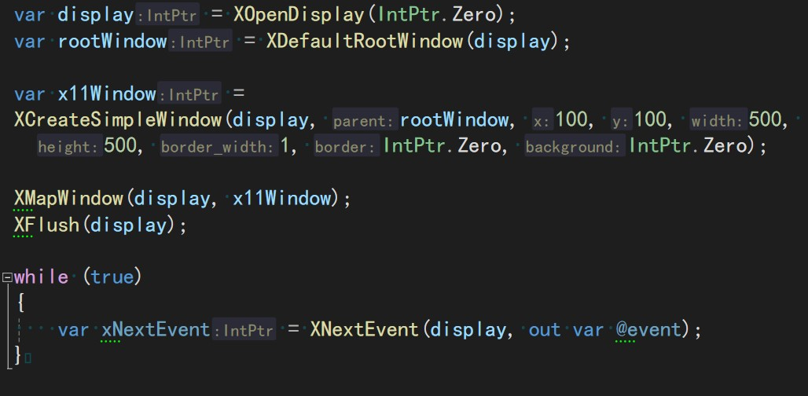
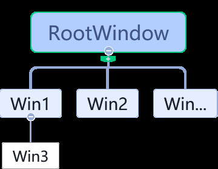
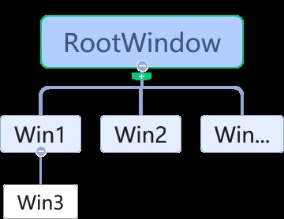

本文记录在 X11 里面的窗口与颜色的位色深关系

<!--more-->


<!-- CreateTime:2024/07/13 07:07:24 -->

<!-- 发布 -->
<!-- 博客 -->

本文属于学习 CPF 框架博客，感谢小红帽的 CPF 框架。更多关于 CPF 框架，请参阅 <https://gitee.com/csharpui/CPF>

本文这里的 24 色或 32 色表示的是用多少个 bit 表示一个像素的颜色。比如常见的 24 色就是 RGB 三个颜色分量，一个颜色分量占 8 个 bit 长度。而 32 色常见就是在 24 色基础上加上 8 个 bit 的 Alpha 透明度。简单理解就是 24 色是不带透明的，而 32 色是带透明的

在 X11 里面，简单的创建窗口的代码大概如下图所示（看不见图片的话，开浏览器的不安全内容兼容，我的图片是 http 的不是 https 的）

<!--  -->


此时创建出来的窗口是默认 24 色的

为什么呢？通过开源的 XLib 的[源代码](https://gitlab.freedesktop.org/xorg/lib/libx11/-/blob/9399caf2c12cbe1ed56f4f6b368c5811cb5d0458/src/CrWindow.c) 可以看到 XCreateSimpleWindow 的函数实现代码如下

```c
Window XCreateSimpleWindow(
    register Display *dpy,
    Window parent,
    int x,
    int y,
    unsigned int width,
    unsigned int height,
    unsigned int borderWidth,
    unsigned long border,
    unsigned long background)
{
    Window wid;
    register xCreateWindowReq *req;

    LockDisplay(dpy);
    GetReqExtra(CreateWindow, 8, req);
    req->parent = parent;
    req->x = x;
    req->y = y;
    req->width = width;
    req->height = height;
    req->borderWidth = borderWidth;
    req->depth = 0;
    req->class = CopyFromParent;
    req->visual = CopyFromParent;
    wid = req->wid = XAllocID(dpy);
    req->mask = CWBackPixel | CWBorderPixel;

    {
	register CARD32 *valuePtr = (CARD32 *) NEXTPTR(req,xCreateWindowReq);
	*valuePtr++ = background;
	*valuePtr = border;
    }

    UnlockDisplay(dpy);
    SyncHandle();
    return (wid);
}
```

上面代码核心就是 XCreateSimpleWindow 的各个配置都是 CopyFromParent 的。那上图的 XCreateSimpleWindow 传入的 parent 是什么？其实就是 RootWindow 窗口

在 X11 里面，所有的窗口都是 RootWindow 窗口的子窗口

<!--  -->


尝试使用以下代码来获取 RootWindow 的色深

```csharp
using static CPF.Linux.XLib;

var display = XOpenDisplay(IntPtr.Zero);
var screen = XDefaultScreen(display);

var rootWindow = XRootWindow(display, screen);
var rootWindowWindowAttributes = new XWindowAttributes();
XGetWindowAttributes(display, rootWindow, ref rootWindowWindowAttributes);
Console.WriteLine($"RootWindowDepth={rootWindowWindowAttributes.depth}");
```

可以看到控制台输出的是 `RootWindowDepth=24` 的内容，证明默认就是 24 色

在[堆栈网](https://stackoverflow.com/a/6099890)上也有大佬说了这个事情

<!--  -->


在很古老的时候默认的 X11 就使用的是 24 色，不包含透明色

而对于 CPF 或 Avalonia 框架来说，所创建的窗口默认都是 32 色。其创建窗口的方法大概的代码如下

```csharp
var display = XOpenDisplay(IntPtr.Zero);
var screen = XDefaultScreen(display);
var rootWindow = XDefaultRootWindow(display);

XMatchVisualInfo(display, screen, depth: 32, klass: 4, out var info);
var visual = info.visual;

... // 省略代码
var valueMask = ...
var xSetWindowAttributes = new XSetWindowAttributes { ... };

var handle = XCreateWindow(display, rootWindow, x: 0, y: 0, width, height, border_width: 5,
    depth: 32,
    (int) CreateWindowArgs.InputOutput,
    visual,
    (nuint) valueMask, ref xSetWindowAttributes);
```

可以看到是在 XMatchVisualInfo 里面传入 32 颜色深度获取的 visual 以及创建窗口时也传入同样的 32 颜色深度

以上代码放在 [github](https://github.com/lindexi/lindexi_gd/tree/ccaa9a2c0e7761074a463f2bcfdc002c36e9c529/X11/FebijebefaiKeremcijee) 和 [gitee](https://gitee.com/lindexi/lindexi_gd/tree/ccaa9a2c0e7761074a463f2bcfdc002c36e9c529/X11/FebijebefaiKeremcijee) 上，可以使用如下命令行拉取代码

先创建一个空文件夹，接着使用命令行 cd 命令进入此空文件夹，在命令行里面输入以下代码，即可获取到本文的代码

```
git init
git remote add origin https://gitee.com/lindexi/lindexi_gd.git
git pull origin ccaa9a2c0e7761074a463f2bcfdc002c36e9c529
```

以上使用的是 gitee 的源，如果 gitee 不能访问，请替换为 github 的源。请在命令行继续输入以下代码，将 gitee 源换成 github 源进行拉取代码

```
git remote remove origin
git remote add origin https://github.com/lindexi/lindexi_gd.git
git pull origin ccaa9a2c0e7761074a463f2bcfdc002c36e9c529
```

获取代码之后，进入 X11/FebijebefaiKeremcijee 文件夹，即可获取到源代码

以上代码的 XMatchVisualInfo 方法只是尝试匹配，虽然现在大部分设备都是支持 32 色的，但是依然有些旧设备或者特殊需求的系统会配置只支持 24 色。推荐的做法是进行一次降级。那如果只支持更低的颜色呢？那此时无论是 CPF 还是 Avalonia 还是 UNO 都开始顶不住了，如果有这样的需求，那还请到各自的开源仓库提需求

对于旧的 UNO 框架，在创建软渲染的 X11 平台的窗口时，使用的是 XCreateSimpleWindow 进行创建，这将会导致无法设置窗口背景透明。核心原因是 XCreateSimpleWindow 加 RootWindow 的组合是 24 色的。我在 [UNO/#16956](https://github.com/unoplatform/uno/pull/16956) 里将其修改。也在 UNO 里面加入了自动降级的功能，即默认尝试使用 32 色深度创建窗口，如果不支持再降低到 24 色

窗口的颜色深度将会影响到各个方面，其中最受影响的是创建 XImage 部分。在使用 XCreateImage 或者直接 new XImage 的时候，都需要传入 depth 参数的值。这里的 depth 参数需要和窗口的颜色深度匹配，否则将会看到一些奇怪的错误

额外说明的是对于 XImage 来说，深度是一回事，还有颜色格式也是很重要的

在 X11 里面有 XYBitmap 和 XYPixmap 和 ZPixmap 三个不同的格式，其中 ZPixmap 是一个像素接着一个像素的排序过去的，和 DirectX 或 OpenGL 等的像素格式能够非常好的贴近。当然了，这里绝大部分情况下都是和 DirectX 没有关系的啦，这里只是强行关联而已

那 XYPixmap 是什么格式的呢？这个格式是每个颜色分量一个通道表示，一个个通道的值排列过去。即按照一个个像素里面的每个颜色分量分别列举出来。和 ZPixmap 做一个对比，大概可以通过如下的颜色值看起来其差异

```
ZPixmap ： RGBA RGBA RGBA RGBA RGBA RGBA
XYPixmap:  RRRR RRRR GGGG GGGG BBBB BBBB 
```

假如数据的传入是一点点传输过来的，那么也许用户可以在 XYPixmap 格式里面的输出看到先是画出整个画面的红色部分，再叠加绿色部分，最后再叠加蓝色部分。也许这是在古老的设备里面有所性能优化的。但是这样的格式无论是 OpenGL 还是 DirectX 都会不开森的，写引擎的开发者说不定也不会开森的

最后的 XYBitmap 格式其实就是 XYPixmap 的弱化版本，即只支持一个颜色分量，常用于简单的黑白图

在 Skia 里面，如果想要和 ZPixmap 相对应，就需要使用 `SKColorType.Bgra8888` 格式，在 32 色深下配置 `SKAlphaType.Premul` 参数。这里的 Bgra8888 表示的意思就是使用 BGRA 这几个颜色分量，且每个分量使用 8 个 bit 表示，也就是一个像素总共是 8 个 bit 乘以 4 个颜色分量，就是 32 个 bit 长度

常用的与 X11 对接的 Skia 的创建代码如下

```csharp
        var skBitmap = new SKBitmap(xDisplayWidth, xDisplayHeight, SKColorType.Bgra8888, SKAlphaType.Premul);
```

对应的创建 XImage 的代码如下

```csharp
        const int bytePerPixelCount = 4; // RGBA 一共4个 byte 长度
        var bitPerByte = 8;

        var xImage = new XImage();
        int bitsPerPixel = bytePerPixelCount * bitPerByte;
        xImage.width = skBitmap.Width;
        xImage.height = skBitmap.Height;
        xImage.format = 2; //ZPixmap;
        xImage.data = skBitmap.GetPixels();
        xImage.byte_order = 0; // LSBFirst;
        xImage.bitmap_unit = bitsPerPixel;
        xImage.bitmap_bit_order = 0; // LSBFirst;
        xImage.bitmap_pad = bitsPerPixel;
        xImage.depth = bitsPerPixel;
        xImage.bytes_per_line = skBitmap.Width * bytePerPixelCount;
        xImage.bits_per_pixel = bitsPerPixel;
        XInitImage(ref xImage);
```

以上方式是 Skia 进行软渲染与 X11 对接的常用代码

当 Skia 绘制完成之后，收到 X11 的曝光事件时，可以使用 XPutImage 进行推送，大概代码如下

```csharp
            if (@event.type == XEventName.Expose)
            {
                // 曝光时，可以收到需要重新绘制的范围
                XPutImage(Display, Window, GC, ref _image, @event.ExposeEvent.x, @event.ExposeEvent.y, @event.ExposeEvent.x, @event.ExposeEvent.y, (uint) @event.ExposeEvent.width,
                    (uint) @event.ExposeEvent.height);
            }

    private XImage _image;
```

在进行曝光推送之后，即可立刻使用 Skia 进行绘制下一个画面，不需要担心此时 XImage 还没推送出去以及可能存在的多线程问题。这是因为在默认的 Lib-X11 的实现里面，调用 XPutImage 时，将会立刻将 XImage 的 data 进行拷贝

在本文以下代码来自于 <https://gitlab.freedesktop.org/xorg/lib/libx11> 的 97fb5bda3d0777380cd4b964f48771a82ef3f2a7 版本。在 xlib.h 定义的 XPutImage 代码如下

```c
extern int XPutImage(
    Display*		/* display */,
    Drawable		/* d */,
    GC			/* gc */,
    XImage*		/* image */,
    int			/* src_x */,
    int			/* src_y */,
    int			/* dest_x */,
    int			/* dest_y */,
    unsigned int	/* width */,
    unsigned int	/* height */
);
```

核心实现在 PutImage.c 文件里面，核心实现或进入的代码如下，以下代码有删减

```c
int
XPutImage (
    register Display *dpy,
    Drawable d,
    GC gc,
    register XImage *image,
    int req_xoffset,
    int req_yoffset,
    int x,
    int y,
    unsigned int req_width,
    unsigned int req_height)

{
        ...
	    LockDisplay(dpy);
	    FlushGC(dpy, gc);
	    PutSubImage(dpy, d, gc, &img, 0, 0, x, y,
			(unsigned int) width, (unsigned int) height,
			dest_bits_per_pixel, dest_scanline_pad);
	    UnlockDisplay(dpy);
        ...
}
```

以上的 PutSubImage 为核心实现，此方法用于推送图片的一部分内容

其核心实现代码如下，以下代码有删减

```c
static void
PutSubImage (
    register Display *dpy,
    Drawable d,
    GC gc,
    register XImage *image,
    int req_xoffset,
    int req_yoffset,
    int x, int y,
    unsigned int req_width,
    unsigned int req_height,
    int dest_bits_per_pixel,
    int dest_scanline_pad)
{
        ...
        PutImageRequest(dpy, d, gc, image, req_xoffset, req_yoffset, x, y,
			req_width, req_height,
			dest_bits_per_pixel, dest_scanline_pad);
        ...
}
```

继续进入 PutImageRequest 方法的实现，代码如下

```c
static void
PutImageRequest(
    register Display *dpy,
    Drawable d,
    GC gc,
    register XImage *image,
    int req_xoffset, int req_yoffset,
    int x, int y,
    unsigned int req_width, unsigned int req_height,
    int dest_bits_per_pixel, int dest_scanline_pad)
{
    register xPutImageReq *req;

    GetReq(PutImage, req);
    req->drawable = d;
    req->gc = gc->gid;
    req->dstX = x;
    req->dstY = y;
    req->width = req_width;
    req->height = req_height;
    req->depth = image->depth;
    req->format = image->format;
    if ((image->bits_per_pixel == 1) || (image->format != ZPixmap))
	SendXYImage(dpy, req, image, req_xoffset, req_yoffset);
    else
	SendZImage(dpy, req, image, req_xoffset, req_yoffset,
		   dest_bits_per_pixel, dest_scanline_pad);
}
```

以上代码的 SendXYImage 和 SendZImage 就是分别对应上文的 XYBitmap 和 XYPixmap 和 ZPixmap 格式了。基本上咱会使用的都是 ZPixmap 格式，也就进入 SendZImage 方法

两个方法的实现逻辑都差不多，核心代码如下，以下代码有删减

```c
static void
SendZImage(
    register Display *dpy,
    register xPutImageReq *req,
    register XImage *image,
    int req_xoffset, int req_yoffset,
    int dest_bits_per_pixel, int dest_scanline_pad)
{
    ...
    src = (unsigned char *)image->data +
	  (req_yoffset * image->bytes_per_line) +
	  ((req_xoffset * image->bits_per_pixel) >> 3);

	Data(dpy, (char *)src, length);
    ...
}
```

以上的 Data 是一个宏定义，大概代码如下

```c
#define Data(dpy, data, len) {\
	if (dpy->bufptr + (len) <= dpy->bufmax) {\
		memcpy(dpy->bufptr, data, (size_t)(len));\
		dpy->bufptr += ((size_t)((len) + 3) & (size_t)~3);\
	} else\
		_XSend(dpy, (_Xconst char*)(data), (long)(len));\
}
```

可以看到在缓冲区没有满的情况下，将会使用 memcpy 将其进行拷贝到缓冲区。缓冲区满的时候，将立刻发送出去

通过以上代码可以看到，调用 XPutImage 之后，将会使用 memcpy 方法将传入的 XImage 的 data 进行拷贝，这也就是为什么在调用完成 XPutImage 之后，可以立刻让 Skia 绘制画面的原因

通过以上逻辑也可以看到此时的使用 Skia 进行软渲染绘制，是需要在 XLib 底层做一次图片像素二进制拷贝的，即 Skia 输出内容不是直接到屏幕的，相当于离屏渲染，再通过 XLib 将图片发送到 X 服务进行绘制，最后再显示到屏幕上

更多细节还请大家自行阅读源代码，这部分代码很多都是 20 多年都没有更改的

更多 X11 开发请参阅 [博客导航](https://blog.lindexi.com/post/%E5%8D%9A%E5%AE%A2%E5%AF%BC%E8%88%AA.html )

<!-- RUN sed -i -e 's/# en_US.UTF-8 UTF-8/en_US.UTF-8 UTF-8/' /etc/locale.gen && \
    echo 'LANG="en_US.UTF-8"'>/etc/default/locale && \
    dpkg-reconfigure --frontend=noninteractive locales && \
    update-locale LANG=en_US.UTF-8
ENV LANG en_US.UTF-8
ENV LANG en_US.UTF-8
ENV LANGUAGE en_US.UTF-8
ENV LC_ALL en_US.UTF-8 -->
