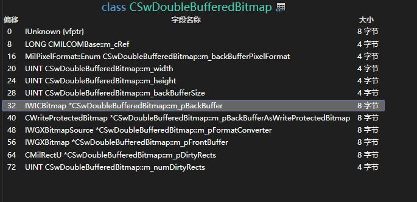

在 WPF 框架底层里面，对 WriteableBitmap 的实现是有双份内存，具体实现放在 CSwDoubleBufferedBitmap 里面。表层的内存是一个数组，里层内存是 IWICBitmap 对象，渲染时将使用 IWICBitmap 对象加入到渲染管线

<!--more-->


<!-- CreateTime:2025/04/24 07:09:57 -->

<!-- 发布 -->
<!-- 博客 -->

本文将告诉大家如何在 WPF 里面，从 WriteableBitmap 里获取到渲染线程使用的 IWICBitmap 对象。本文提供的方法仅仅只能用于辅助大家了解 WPF 的机制，对实际产品使用没有帮助。无法通过本文提供的方式减少 WriteableBitmap 的一次 CPU 拷贝

如 [dotnet 读 WPF 源代码笔记 WriteableBitmap 的渲染和更新是如何实现](https://blog.lindexi.com/post/dotnet-%E8%AF%BB-WPF-%E6%BA%90%E4%BB%A3%E7%A0%81%E7%AC%94%E8%AE%B0-WriteableBitmap-%E7%9A%84%E6%B8%B2%E6%9F%93%E5%92%8C%E6%9B%B4%E6%96%B0%E6%98%AF%E5%A6%82%E4%BD%95%E5%AE%9E%E7%8E%B0.html ) 博客所述，在 WPF 框架底层使用 CSwDoubleBufferedBitmap 存储 WriteableBitmap 的数据。如 CSwDoubleBufferedBitmap 命名所示，这是一个包含了双缓存的类型

在 CSwDoubleBufferedBitmap 里面包含的双缓存可以分为表层和里层两个缓存。表层是一个数组，用于给 WPF 应用上层业务方使用，直接可以在 UI 线程任何时刻使用。里层是 IWICBitmap 对象，这个 IWICBitmap 对象将从表层内存拷贝数据，渲染时将被加入到管线中参与绘制

这个过程里面，将发生两次 CPU 到 CPU 的内存拷贝，以及一次 CPU 到 GPU 的内存拷贝。为什么这么说呢，首先业务方需要将数据写入到 WriteableBitmap 里面，这个过程就是第一次 CPU 到 CPU 的内存拷贝。不严谨的表述可以这么认为，写入到 WriteableBitmap 的过程就是将数据“拷贝”到 WriteableBitmap 的过程，这个过程中完全发生在 CPU 计算里面，这就是我说的第一次 CPU 到 CPU 的内存拷贝过程。那第二次 CPU 到 CPU 发生在哪？发生在渲染线程中，第一次 CPU 到 CPU 拷贝过程里面是将业务方的数据拷贝到 WriteableBitmap 的表层内存里面，即 CSwDoubleBufferedBitmap 的 `m_pFrontBuffer` 里面，第二次 CPU 到 CPU 拷贝是在 CSwDoubleBufferedBitmap 里面，在 `CSwDoubleBufferedBitmap.CopyForwardDirtyRects` 里面从 `m_pFrontBuffer` 拷贝到 `CWriteProtectedBitmap *  m_pBackBufferAsWriteProtectedBitmap` 里面，即从表层内存拷贝到里层 IWICBitmap 对象里

最后一次 CPU 到 GPU 的内存拷贝是什么呢？那就是将 IWICBitmap 对象加入到渲染管线时，从 CPU 将数据同步到 GPU 上

我开始认为可以绕过 CSwDoubleBufferedBitmap 里面的一次 CPU 到 CPU 的拷贝，减少表层内存拷贝到里层 IWICBitmap 对象里的耗时，我直接就访问 CSwDoubleBufferedBitmap 的 `IWICBitmap * m_pBackBuffer` 对象，对其写入数据，于是就进行了本文的测试

当然了，最后我发现即使我成功拿到了 IWICBitmap 对象，且对其写入数据，最后要么就是没有通知到变更没有刷新渲染，要么就是被表层内存给覆盖了。没有任何的优化。如果大家对 WriteableBitmap 的写入性能感兴趣，推荐拉取 [WPF 性能测试](https://blog.lindexi.com/post/WPF-%E6%80%A7%E8%83%BD%E6%B5%8B%E8%AF%95.html ) 博客里面的代码进行测试
<!-- [WPF 性能测试 - lindexi - 博客园](https://www.cnblogs.com/lindexi/p/17678694.html ) -->

为了获取到 CSwDoubleBufferedBitmap 的 `IWICBitmap * m_pBackBuffer` 对象，我按照 [lsj](https://blog.sdlsj.net) 教我的方法，从 VisualStudio 里面查看 CSwDoubleBufferedBitmap 类的布局。即鼠标移动到类定义上，点击查看内存布局，即可看到如下图内容

<!--  -->


如此即可看到 `IWICBitmap * m_pBackBuffer` 对象是 32 偏移量，刚好这是第一个指针，无论是 x86 还是 x64 都是 32 偏移量，于是定义如下结构体

```csharp
[StructLayout(LayoutKind.Explicit)]
struct CSwDoubleBufferedBitmap
{
    // IWICBitmap *                        m_pBackBuffer;
    [FieldOffset(32)]
    public nint WicBitmap; // 刚好 m_pBackBuffer 就是第一个指针字段，无论是 x86 还是 x64 都刚好是第 32 个字节
}
```

在 WriteableBitmap 类型里面，将其存放到 `_pDoubleBufferedBitmap` 字段里面，如以下 WPF 代码所示

```csharp
    public sealed class WriteableBitmap : BitmapSource
    {
        ... // 忽略其他代码

        private SafeMILHandle _pDoubleBufferedBitmap;   // CSwDoubleBufferedBitmap
    }
```

简单使用反射获取一下，然后指针转换为 `struct CSwDoubleBufferedBitmap` 结构体，代码如下

```csharp
        var writeableBitmap = (WriteableBitmap) Image.Source;
        var type = writeableBitmap.GetType();

        var fieldInfo = type.GetField("_pDoubleBufferedBitmap", BindingFlags.NonPublic | BindingFlags.Instance);
        if (fieldInfo?.GetValue(writeableBitmap) is SafeHandleZeroOrMinusOneIsInvalid
            doubleBufferedBitmapHandle)
        {
            var handle = doubleBufferedBitmapHandle.DangerousGetHandle();
            var doubleBufferedBitmap = Marshal.PtrToStructure<CSwDoubleBufferedBitmap>(handle);
            ... // 忽略其他代码
        }
```

以上拿到的 `doubleBufferedBitmap` 就是 `struct CSwDoubleBufferedBitmap` 结构体

为了测试所拿到的 `CSwDoubleBufferedBitmap.WicBitmap` 是 IWICBitmap 对象，我通过 `stakx.WIC` 库将其转换为 `stakx.WIC.IWICBitmap` 对象，代码如下

```csharp
            var wicBitmap = (IWICBitmap) Marshal.GetObjectForIUnknown(doubleBufferedBitmap.WicBitmap);
            var size = wicBitmap.GetSize();
```

以上尝试调用 GetSize 方法，如果能够返回创建 WriteableBitmap 时传入的尺寸，则证明获取正确

再进一步阅读 WPF 源代码，我发现了其实不需要从 CSwDoubleBufferedBitmap 里面即可拿到 IWICBitmap 对象，这是因为在 WriteableBitmap 还存在如下这一段代码

```csharp
    public sealed class WriteableBitmap : BitmapSource
    {
        ... // 忽略其他代码
        private bool AcquireBackBuffer(TimeSpan timeout, bool waitForCopy)
        {
        	... // 忽略其他代码
            MILSwDoubleBufferedBitmap.GetBackBuffer(
                _pDoubleBufferedBitmap,
                out _pBackBuffer,
                out _backBufferSize);
        	_syncObject = WicSourceHandle = _pBackBuffer;
        	... // 忽略其他代码
        }
        private BitmapSourceSafeMILHandle _pBackBuffer; // IWICBitmap
    }
```

即可以直接拿到 `WicSourceHandle` 属性或 `_pBackBuffer` 字段即可，反射获取的代码如下

```csharp
        var writeableBitmap = (WriteableBitmap) Image.Source;
        var type = writeableBitmap.GetType();
        var propertyInfo = type.GetProperty("WicSourceHandle", BindingFlags.NonPublic | BindingFlags.Instance);
        var value = propertyInfo?.GetValue(writeableBitmap);
        nint wicBitmapHandle = 0;
        if (value is SafeHandleZeroOrMinusOneIsInvalid safeHandle)
        {
            var handle = safeHandle.DangerousGetHandle();
            wicBitmapHandle = handle;
            var wicBitmap = (IWICBitmap) Marshal.GetObjectForIUnknown(handle);

            var size = wicBitmap.GetSize();
            var buffer = new byte[size.Width * size.Height * 4];
            Random.Shared.NextBytes(buffer);

            // 这里的绘制是无效的，因为在 WPF 底层会重新被 m_pFrontBuffer 覆盖
            wicBitmap.CopyPixels(4 * size.Width, buffer);
        }
        Debug.Assert(wicBitmapHandle != 0);
```

为了证明通过 WicSourceHandle 属性获取的和从 CSwDoubleBufferedBitmap 获取到相同的值，我添加了 `wicBitmapHandle` 局部变量，修改代码添加如下判断逻辑，实际证明两个方式获取到的是相同的值

```csharp
        var fieldInfo = type.GetField("_pDoubleBufferedBitmap", BindingFlags.NonPublic | BindingFlags.Instance);
        if (fieldInfo?.GetValue(writeableBitmap) is SafeHandleZeroOrMinusOneIsInvalid
            doubleBufferedBitmapHandle)
        {
            var handle = doubleBufferedBitmapHandle.DangerousGetHandle();
            var doubleBufferedBitmap = Marshal.PtrToStructure<CSwDoubleBufferedBitmap>(handle);
            Debug.Assert(doubleBufferedBitmap.WicBitmap == wicBitmapHandle);
        }
```

这也符合 CSwDoubleBufferedBitmap 里面的逻辑

```c++
void
CSwDoubleBufferedBitmap::GetBackBuffer(
    __deref_out IWICBitmap **ppBackBuffer,
    __out_opt UINT * pBackBufferSize
    ) const
{
    SetInterface(*ppBackBuffer, m_pBackBuffer);

    if (pBackBufferSize != NULL)
    {
        *pBackBufferSize = m_backBufferSize;
    }
}
```

本文代码放在 [github](https://github.com/lindexi/lindexi_gd/tree/a920291d64e1163ffa40f4134c2a8c56cbbf1342/WPFDemo/CabawgakaicurrecalLalkiniyajagear) 和 [gitee](https://gitee.com/lindexi/lindexi_gd/blob/a920291d64e1163ffa40f4134c2a8c56cbbf1342/WPFDemo/CabawgakaicurrecalLalkiniyajagear) 上，可以使用如下命令行拉取代码。我整个代码仓库比较庞大，使用以下命令行可以进行部分拉取，拉取速度比较快

先创建一个空文件夹，接着使用命令行 cd 命令进入此空文件夹，在命令行里面输入以下代码，即可获取到本文的代码

```
git init
git remote add origin https://gitee.com/lindexi/lindexi_gd.git
git pull origin a920291d64e1163ffa40f4134c2a8c56cbbf1342
```

以上使用的是国内的 gitee 的源，如果 gitee 不能访问，请替换为 github 的源。请在命令行继续输入以下代码，将 gitee 源换成 github 源进行拉取代码。如果依然拉取不到代码，可以发邮件向我要代码

```
git remote remove origin
git remote add origin https://github.com/lindexi/lindexi_gd.git
git pull origin a920291d64e1163ffa40f4134c2a8c56cbbf1342
```

获取代码之后，进入 WPFDemo/CabawgakaicurrecalLalkiniyajagear 文件夹，即可获取到源代码

更多 WPF 框架原理博客，请参阅 [博客导航](https://blog.lindexi.com/post/%E5%8D%9A%E5%AE%A2%E5%AF%BC%E8%88%AA.html )

更新：

有伙伴反馈说用 `stakx.WIC` 太旧了，没有能够用上最新的 COM 函数指针调用技术。用函数指针调用技术可以做到无中间商赚差价，无 COM 对象包装，直接调用，性能无敌且 AOT 友好。小伙伴就让我写用 Vortice 库的调用方法，直接走 Vortice 封装好的函数指针调用。我这里就来更新，先原有代码不动，先卸载 `stakx.WIC` 库，换成安装 `Vortice.Win32.Graphics.Imaging` 库，修改之后的 csproj 项目文件代码大概如下

```xml
<Project Sdk="Microsoft.NET.Sdk">

  <PropertyGroup>
    <OutputType>WinExe</OutputType>
    <TargetFramework>net9.0-windows</TargetFramework>
    <Nullable>enable</Nullable>
    <ImplicitUsings>enable</ImplicitUsings>
    <UseWPF>true</UseWPF>
    <AllowUnsafeBlocks>true</AllowUnsafeBlocks>
  </PropertyGroup>

  <ItemGroup>
    <PackageReference Include="Vortice.Win32.Graphics.Imaging" Version="2.2.7" />
  </ItemGroup>

</Project>
```

依然是从反射获取 WriteableBitmap 的 WicSourceHandle 属性，拿到的 `wicBitmapHandle` 变量，原来代码如下

```csharp
        var writeableBitmap = (WriteableBitmap) Image.Source;
        var type = writeableBitmap.GetType();
        var propertyInfo = type.GetProperty("WicSourceHandle", BindingFlags.NonPublic | BindingFlags.Instance);
        var value = propertyInfo?.GetValue(writeableBitmap);
        nint wicBitmapHandle = 0;
        if (value is SafeHandleZeroOrMinusOneIsInvalid safeHandle)
        {
            var handle = safeHandle.DangerousGetHandle();
            wicBitmapHandle = handle;
            ...
        }
```

这里拿到的 `wicBitmapHandle` 实际上是一个 COM 的 pvtable 指针，对应着 C# 函数指针里面应该是 `(void***)` 类型，需要取值才能作为 `void**` 传入到 `Win32.Graphics.Imaging.IWICBitmap` 的 lpVtbl 字段里面。也可以这么认为，拿到的 `wicBitmapHandle` 就是 COM 对象本身，这个 COM 对象首个字段就是 `vtable` 字段，取首个字段的值就是取 `wicBitmapHandle[0]` 的值，刚好 `[0]` 等于自身，可以约掉不写。整理之后的代码如下，请不要被 `(void***)` 吓到

```csharp
            var handle = safeHandle.DangerousGetHandle();
            wicBitmapHandle = handle;
            var wicBitmap = new IWICBitmap();
            unsafe
            {
                void*** pvtable = (void***) wicBitmapHandle;
                void** vtable = *pvtable;
                wicBitmap.lpVtbl = vtable;

                uint w = 0, h = 0;
                wicBitmap.GetSize(&w, &h);
            }
```

转换完成之后，尝试调用 GetSize 方法，可以获取到宽度高度符合传入的初始宽度高度，证明转换正确

更新的代码放在 [github](https://github.com/lindexi/lindexi_gd/tree/ff2b1566292ce1ebc40d579d9f7ea71c0086f9a3/WPFDemo/JaikikerallkurBerhayeajur) 和 [gitee](https://gitee.com/lindexi/lindexi_gd/blob/ff2b1566292ce1ebc40d579d9f7ea71c0086f9a3/WPFDemo/JaikikerallkurBerhayeajur) 上，可以使用如下命令行拉取代码。我整个代码仓库比较庞大，使用以下命令行可以进行部分拉取，拉取速度比较快

先创建一个空文件夹，接着使用命令行 cd 命令进入此空文件夹，在命令行里面输入以下代码，即可获取到本文的代码

```
git init
git remote add origin https://gitee.com/lindexi/lindexi_gd.git
git pull origin ff2b1566292ce1ebc40d579d9f7ea71c0086f9a3
```

以上使用的是国内的 gitee 的源，如果 gitee 不能访问，请替换为 github 的源。请在命令行继续输入以下代码，将 gitee 源换成 github 源进行拉取代码。如果依然拉取不到代码，可以发邮件向我要代码

```
git remote remove origin
git remote add origin https://github.com/lindexi/lindexi_gd.git
git pull origin ff2b1566292ce1ebc40d579d9f7ea71c0086f9a3
```

获取代码之后，进入 WPFDemo/JaikikerallkurBerhayeajur 文件夹，即可获取到源代码

更多 COM 函数指针调用，请参阅 [演练 dotnet 使用 函数指针 调用 COM 接口](https://blog.lindexi.com/post/%E6%BC%94%E7%BB%83-dotnet-%E4%BD%BF%E7%94%A8-%E5%87%BD%E6%95%B0%E6%8C%87%E9%92%88-%E8%B0%83%E7%94%A8-COM-%E6%8E%A5%E5%8F%A3.html )
<!-- [演练 dotnet 使用 函数指针 调用 COM 接口 - lindexi - 博客园](https://www.cnblogs.com/lindexi/p/18684913 ) -->
