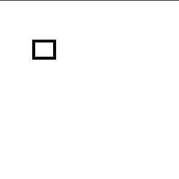
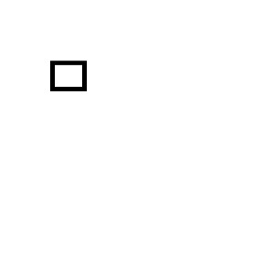
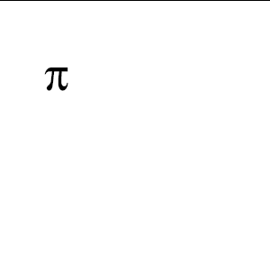
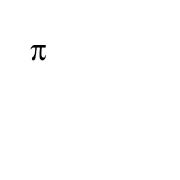

故事的背景是我尝试在纯净的 Debian docker 设备上，使用 Oxage.Wmf 解析转换 WMF 图片，在此过程中我需要使用 SkiaSharp 渲染出字体，一切在 Windows 上跑得好好的，结果在 Linux 上就渲染出方框，无法使用 Symbol 字体渲染出正确的文本

<!--more-->


<!-- CreateTime:2025/07/31 07:05:44 -->

<!-- 发布 -->
<!-- 博客 -->

我尝试在 WPF 里面，无论使用的是 Symbol.ttf 还是 StandardSymbolsPS.ttf 字体，我都能显示出来 `p` 字符为 π 符号。如此即可证明两个字体都是正确的

为什么会额外测试 StandardSymbolsPS.ttf 字体呢？因为 Symbol.ttf 是有版权的，我不能在非 Windows 机器上使用，刚好 StandardSymbolsPS.ttf 字体就是完美的替代字体，两个字体之间只有轮廓是不相同的，其他的都是相同的，设计上就是为了能够规避版权问题

相同的代码，在 Windows 上，就可以在 Skia 里面，使用 Symbol.ttf 或 StandardSymbolsPS.ttf 字体渲染出正确的文本内容，然而在纯净的 Debian 10 docker 容器内，跑出来的输出效果就是渲染出方框，如下图所示

<!--  -->


我的代码如下

```csharp
var symbolFontFile = Path.Join(AppContext.BaseDirectory, "StandardSymbolsPS.ttf");

using var skTypeface =
    SKFontManager.Default.CreateTypeface(symbolFontFile);
Console.WriteLine($"Font='{symbolFontFile}' SKTypeface={skTypeface.FamilyName} GlyphCount={skTypeface.GlyphCount}");

var text = "p"; // 这里的 p 是 Symbol 字体中的 Pi 符号
char testChar = text[0];

Console.WriteLine($"ContainsGlyph('{testChar}')={skTypeface.ContainsGlyph(testChar)} {skTypeface.GetGlyph(testChar)}");

using var skBitmap = new SKBitmap(300, 300, SKColorType.Bgra8888, SKAlphaType.Premul);
skBitmap.Erase(SKColors.White);
using var skCanvas = new SKCanvas(skBitmap);

var skFont = skTypeface.ToFont(50);

using var skPaint = new SKPaint();
skPaint.Color = SKColors.Black;
skPaint.IsAntialias = true;

skCanvas.DrawText(text, 50, 100, skFont, skPaint);

var outputFile = Path.Join(AppContext.BaseDirectory, $"1.png");

using (var outputStream = File.OpenWrite(outputFile))
{
    skBitmap.Encode(outputStream, SKEncodedImageFormat.Png, 100);
}

Console.Read();
```

运行以上代码，可见输出控制台内容如下。输出的 1.png 文件内容就是上图，一个方框

```
Font='/home/lindexi/LenobudelceHilajelinanem/StandardSymbolsPS.ttf' SKTypeface=Standard Symbols PS GlyphCount=191
ContainsGlyph('p')=False 0
```

在 Debian 10 里面，加载字体文件看起来是成功的，因为通过控制台输出的 `GlyphCount=191` 可以看到字符数量是正确的

但是 `skTypeface.ContainsGlyph(testChar)` 返回 false 值，证明无法枚举到正确的字形

为了解决此问题，我引入了 HarfBuzz 作为辅助。使用 HarfBuzzSharp.Font 的 TryGetGlyph 方法获取到 glyph 值。再调进 Skia 的 SKTextBlob.Create 方法，传入 SKTextEncoding.GlyphId 返回 SKTextBlob 对象。最后将 SKTextBlob 放入到 DrawText 方法里面

引入 HarfBuzz 的代码如下

```csharp
using HarfBuzzSharp;

using SkiaSharp;

using System.Diagnostics;
using System.Globalization;
using System.Runtime.InteropServices;

using Buffer = HarfBuzzSharp.Buffer;

var symbolFontFile = Path.Join(AppContext.BaseDirectory, "StandardSymbolsPS.ttf");

var skTypeface =
    SKFontManager.Default.CreateTypeface(symbolFontFile);
Console.WriteLine($"Font='{symbolFontFile}' SKTypeface={skTypeface.FamilyName} GlyphCount={skTypeface.GlyphCount}");

var text = "p"; // 这里的 p 是 Symbol 字体中的 Pi 符号
char testChar = text[0];

Console.WriteLine($"ContainsGlyph('{testChar}')={skTypeface.ContainsGlyph(testChar)} {skTypeface.GetGlyph(testChar)}");

using var skBitmap = new SKBitmap(300, 300, SKColorType.Bgra8888, SKAlphaType.Premul);
skBitmap.Erase(SKColors.White);
using var skCanvas = new SKCanvas(skBitmap);

var skFont = skTypeface.ToFont(50);

using var skPaint = new SKPaint();
skPaint.Color = SKColors.Black;
skPaint.IsAntialias = true;

//skCanvas.DrawText(text, 50, 100, skFont, skPaint);

using (var buffer = new Buffer())
{
    buffer.AddUtf16(text);

    buffer.GuessSegmentProperties();
    buffer.Language = new Language(CultureInfo.CurrentCulture);

    var face = new HarfBuzzSharp.Face(GetTable);

    Blob? GetTable(Face f, Tag tag)
    {
        var size = skTypeface.GetTableSize(tag);
        var data = Marshal.AllocCoTaskMem(size);
        if (skTypeface.TryGetTableData(tag, 0, size, data))
        {
            return new Blob(data, size, MemoryMode.ReadOnly, () => Marshal.FreeCoTaskMem(data));
        }
        else
        {
            return null;
        }
    }

    var font = new HarfBuzzSharp.Font(face);
    font.SetFunctionsOpenType();

    var tryGetGlyph = font.TryGetGlyph('p', out uint glyph);
    Console.WriteLine($"TryGetGlyph={tryGetGlyph} {glyph}");

    ushort glyphId = (ushort) glyph;
    Span<byte> glyphByteSpan = stackalloc byte[sizeof(ushort)];
    MemoryMarshal.Write(glyphByteSpan, glyphId);

    var skTextBlob = SKTextBlob.Create(glyphByteSpan, SKTextEncoding.GlyphId, skFont);
    skCanvas.DrawText(skTextBlob, 50, 100, skPaint);
}

var outputFile = Path.Join(AppContext.BaseDirectory, $"2.png");

using (var outputStream = File.OpenWrite(outputFile))
{
    skBitmap.Encode(outputStream, SKEncodedImageFormat.Png, 100);
}

Console.Read();
```

在 HarfBuzz 辅助下，可以获取到字型，输出如下

```
Font='/home/lindexi/LenobudelceHilajelinanem/StandardSymbolsPS.ttf' SKTypeface=Standard Symbols PS GlyphCount=191
ContainsGlyph('p')=False 0
TryGetGlyph=True 81
```

通过控制台可以看到，虽然依然在 Skia 里面，无法通过 ContainsGlyph 找到字形。但是 HarfBuzzSharp.Font 的 TryGetGlyph 能够拿到正确的 glyph 值

拿到了 glyph 之后，需要使用 `SKTextBlob.Create(glyphByteSpan, SKTextEncoding.GlyphId, skFont)` 创建出 SKTextBlob 对象，最后依然通过 DrawText 方法绘制

尝试在 docker 里面运行以上程序，可见输出的 2.png 是正确的

正确的渲染图如下：

<!--  -->


这也能说明为什么很多时候都是 Skia 和 HarfBuzz 搭配着使用了。在字体处理方向，还是需要依靠 HarfBuzz 的基础设施支持。如果大家发现使用 Skia 渲染某个字体时，只能渲染出方框。可以尝试按照本文的方法，使用 HarfBuzz 做辅助，让 HarfBuzz 从字体里面获取 glyph 字形序号，再配合 SKTextEncoding.GlyphId 创建 SKTextBlob 对象加入渲染

正常的很多字体，直接只使用 Skia 渲染是没有问题的。只是 Symbol 系字体很是特殊，甚至于它都独立在 42 的编码页里面，这是历史问题。当年有 Symbol 的时候还没 Unicode 规范。考古到这一点，也能原谅 Skia 不能很好在 Linux 上处理 Symbol 字体了

本文代码放在 [github](https://github.com/lindexi/lindexi_gd/tree/e5db7d3b8763c1029b67193962b3ac2f73390702/SkiaSharp/LenobudelceHilajelinanem) 和 [gitee](https://gitee.com/lindexi/lindexi_gd/blob/e5db7d3b8763c1029b67193962b3ac2f73390702/SkiaSharp/LenobudelceHilajelinanem) 上，可以使用如下命令行拉取代码。我整个代码仓库比较庞大，使用以下命令行可以进行部分拉取，拉取速度比较快

先创建一个空文件夹，接着使用命令行 cd 命令进入此空文件夹，在命令行里面输入以下代码，即可获取到本文的代码

```
git init
git remote add origin https://gitee.com/lindexi/lindexi_gd.git
git pull origin e5db7d3b8763c1029b67193962b3ac2f73390702
```

以上使用的是国内的 gitee 的源，如果 gitee 不能访问，请替换为 github 的源。请在命令行继续输入以下代码，将 gitee 源换成 github 源进行拉取代码。如果依然拉取不到代码，可以发邮件向我要代码

```
git remote remove origin
git remote add origin https://github.com/lindexi/lindexi_gd.git
git pull origin e5db7d3b8763c1029b67193962b3ac2f73390702
```

获取代码之后，进入 SkiaSharp/LenobudelceHilajelinanem 文件夹，即可获取到源代码。获取到源代码之后，可双击 LenobudelceHilajelinanem.sln 打开项目。项目里面我没有将 StandardSymbolsPS.ttf 字体上传。尽管这是免费的字体，但还是请大家自行到网上下载。一个可选的下载地址是： <https://fontmeme.com/fonts/standard-symbols-font/>

更多技术博客，请参阅 [博客导航](https://blog.lindexi.com/post/%E5%8D%9A%E5%AE%A2%E5%AF%BC%E8%88%AA.html )
